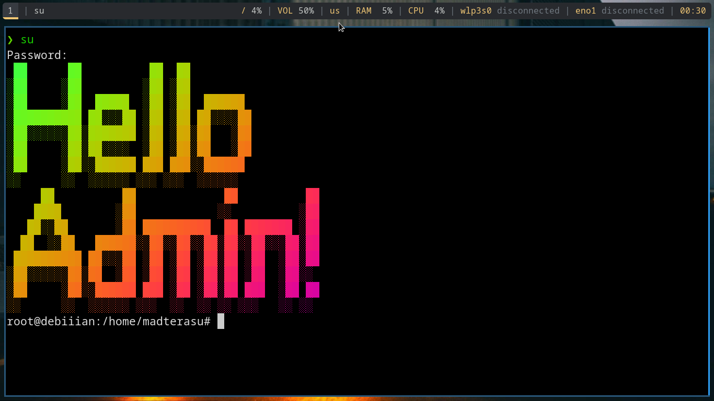

Jreng jet madterasu in the house yoo! 😺 Kali ini aku bakal bagi-bagi cara gampang buat bikin terminal Linux-mu jadi lebih keren dengan bantuan figlet lan lolcat. Yuk, langsung aja kita mulai!

#### Instalasi Bahan-Bahan

Pertama-tama, kita perlu nginstal `figlet` lan `lolcat`. Buka terminal lan jalankan perintah berikut:

```bash
sudo apt install figlet lolcat
```

Selanjutnya, kita perlu download font figlet dari Github. Gunakan perintah berikut:

```bash
git clone https://github.com/xero/figlet-fonts.git
```

Setelah download, copy semua file font ke direktori `figlet`:

```bash
sudo cp figlet-fonts/* /usr/share/figlet/
```

#### Konfigurasi .bashrc

Sekarang, kita perlu ngedit file `.bashrc` ben setiap kali buka terminal, pesan keren langsung muncul ngunu. Buka file `.bashrc` dengan perintah berikut:

```bash
sudo nano /root/.bashrc
```

Tambahkan teks berikut di akhir file `.bashrc`:

```bash
figlet -f 3d Hello World! | lolcat
```

Ini bakal nampilin teks "Hello World!" dengan font 3D lan warna-warni setiap kali kamu buka terminal. 😸

Nah, itu tadi cara gampang buat bikin terminal Linux-mu jadi lebih keren. Selamat mencoba, rekk! Semoga bermanfaat lan jangan lupa sering-sering mampir ke blogku buat dapet tips lan trik keren lainnya! 😸🔧💻